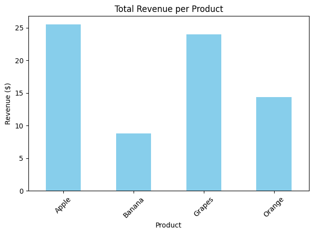

# 📊 Basic Sales Summary using SQLite and Python

📅 Date: 03-07-2025  
📂 Task: Get Basic Sales Summary from a Tiny SQLite Database using Python

---

## 🛠️ Tools Used

- **SQLite** (via Python’s built-in `sqlite3` module)  
- **Python Libraries**: `sqlite3`, `pandas`, `matplotlib`  
- **Environment**: Google Colab (can also run in Jupyter or `.py` file)

---

## 📂 Dataset

- Created a mini SQLite database named: `sales_data.db`
- Table: `sales`
- Manually inserted sample sales data for multiple products

---

## 🎯 Objective

To build a simple sales analytics pipeline using SQL inside Python. The goal was to:
- Query basic sales metrics (like total quantity sold and revenue)
- Display results using Pandas
- Visualize total revenue per product using Matplotlib bar chart

---

## 📦 Dataset Description

The table `sales` contains the following fields:

- `id`: Unique transaction ID (autoincremented)
- `product`: Name of the product sold
- `quantity`: Number of units sold in a transaction
- `price`: Price per unit for that transaction

Sample inserted records:

| product | quantity | price |
|---------|----------|-------|
| Apple   | 10       | 1.5   |
| Banana  | 5        | 0.8   |
| Orange  | 8        | 1.2   |
| Apple   | 7        | 1.5   |
| Banana  | 6        | 0.8   |
| Orange  | 4        | 1.2   |
| Grapes  | 12       | 2.0   |

---

## 🧠 Approach & SQL Concepts Applied

This task demonstrates combining SQL with Python for quick analysis using:

- `SUM(quantity)` to compute total quantity sold  
- `SUM(quantity * price)` to calculate total revenue  
- `GROUP BY product` for product-level aggregation  
- `pandas.read_sql_query()` to load SQL results into a DataFrame  
- `matplotlib.pyplot` for charting

---

## 💻 SQL Query Used

```sql
SELECT 
    product, 
    SUM(quantity) AS total_quantity, 
    SUM(quantity * price) AS revenue 
FROM 
    sales 
GROUP BY 
    product;
```
---

## 🖥️ Output Table (via Pandas):

| product | total_quantity | revenue |
|---------|----------------|---------|
| Apple   | 17             | 25.5    |
| Banana  | 11             | 8.8     |
| Orange  | 12             | 14.4    |
| Grapes  | 12             | 24.0    |

---

## 📊 Visualization:

A bar chart was generated using Matplotlib to display revenue per product.

> If you're using this on GitHub, make sure to upload the chart image as `sales_chart.png` in the same folder.



---

## 📈 Analysis Summary

- The chart clearly highlights product-level revenue distribution.
- **Apple** and **Grapes** had similar total revenue, despite different quantity levels.
- This analysis gives a quick snapshot of product performance using minimal setup.

---

## 📁 Deliverables

- ✅ SQL aggregation query executed via Python  
- ✅ Results printed using Pandas DataFrame  
- ✅ Revenue chart generated and saved as `sales_chart.png`

---

## 📚 Key Learnings

- How to embed SQL inside Python using `sqlite3`  
- Basic usage of SQL aggregation functions (`SUM`, `GROUP BY`)  
- Loading query results into Pandas for further analysis  
- Creating simple data visualizations using `matplotlib`

---

✨ Done by: **Aditya Kankarwal**

